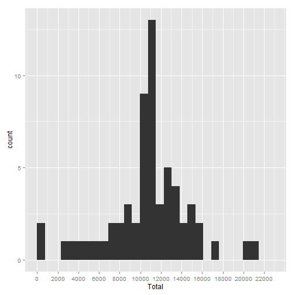

## Loading and preprocessing the data

```r
#Load libraries used by the project
library(plyr)
library(ggplot2)
library(lubridate)

#Load activity data
stepsData <- read.csv("activity.csv",header=TRUE)
```


## What is mean total number of steps taken per day?

```r
#Calculate the total number of steps per day
stepsperday <- ddply(stepsData, c("date"),summarise,Total= sum(steps))

#Make histogram of the total number of steps taken each day
qplot(stepsperday$date,stepsperday$Total, geom="bar", stat="identity")
```

```
## Warning: Removed 8 rows containing missing values (position_stack).
```

 

```r
#Calculate and report the mean and median of the total number of steps per day
ddply(stepsData, c("date"),summarise, Mean= mean(steps),Median = median(steps))
```

```
##          date       Mean Median
## 1  2012-10-01         NA     NA
## 2  2012-10-02  0.4375000      0
## 3  2012-10-03 39.4166667      0
## 4  2012-10-04 42.0694444      0
## 5  2012-10-05 46.1597222      0
## 6  2012-10-06 53.5416667      0
## 7  2012-10-07 38.2465278      0
## 8  2012-10-08         NA     NA
## 9  2012-10-09 44.4826389      0
## 10 2012-10-10 34.3750000      0
## 11 2012-10-11 35.7777778      0
## 12 2012-10-12 60.3541667      0
## 13 2012-10-13 43.1458333      0
## 14 2012-10-14 52.4236111      0
## 15 2012-10-15 35.2048611      0
## 16 2012-10-16 52.3750000      0
## 17 2012-10-17 46.7083333      0
## 18 2012-10-18 34.9166667      0
## 19 2012-10-19 41.0729167      0
## 20 2012-10-20 36.0937500      0
## 21 2012-10-21 30.6284722      0
## 22 2012-10-22 46.7361111      0
## 23 2012-10-23 30.9652778      0
## 24 2012-10-24 29.0104167      0
## 25 2012-10-25  8.6527778      0
## 26 2012-10-26 23.5347222      0
## 27 2012-10-27 35.1354167      0
## 28 2012-10-28 39.7847222      0
## 29 2012-10-29 17.4236111      0
## 30 2012-10-30 34.0937500      0
## 31 2012-10-31 53.5208333      0
## 32 2012-11-01         NA     NA
## 33 2012-11-02 36.8055556      0
## 34 2012-11-03 36.7048611      0
## 35 2012-11-04         NA     NA
## 36 2012-11-05 36.2465278      0
## 37 2012-11-06 28.9375000      0
## 38 2012-11-07 44.7326389      0
## 39 2012-11-08 11.1770833      0
## 40 2012-11-09         NA     NA
## 41 2012-11-10         NA     NA
## 42 2012-11-11 43.7777778      0
## 43 2012-11-12 37.3784722      0
## 44 2012-11-13 25.4722222      0
## 45 2012-11-14         NA     NA
## 46 2012-11-15  0.1423611      0
## 47 2012-11-16 18.8923611      0
## 48 2012-11-17 49.7881944      0
## 49 2012-11-18 52.4652778      0
## 50 2012-11-19 30.6979167      0
## 51 2012-11-20 15.5277778      0
## 52 2012-11-21 44.3993056      0
## 53 2012-11-22 70.9270833      0
## 54 2012-11-23 73.5902778      0
## 55 2012-11-24 50.2708333      0
## 56 2012-11-25 41.0902778      0
## 57 2012-11-26 38.7569444      0
## 58 2012-11-27 47.3819444      0
## 59 2012-11-28 35.3576389      0
## 60 2012-11-29 24.4687500      0
## 61 2012-11-30         NA     NA
```


## What is the average daily activity pattern?

```r
#Get mean steps ignoring NA values
tepsperinterval <- ddply(stepsData, c("interval"),summarise, mean= mean(steps,na.rm=TRUE))
#Time Series of 5 minute interval and the avg number of steps  across all days
ggplot(stepsperinterval, aes(x=interval, y=mean)) + geom_line()
```

 

```r
ggplot(stepsperinterval, aes(x=interval, y=mean)) + geom_line()+ geom_text(data=stepsperinterval[which.max(stepsperinterval$mean),], label=paste("Steps",stepsperinterval[which.max(stepsperinterval$mean),2],"Interval",stepsperinterval[which.max(stepsperinterval$mean),1]))
```

 

```r
#Interval 835 has maxinum number of steps 206.1698
```

## Imputing missing values

```r
#Count na values 230
sum(is.na(stepsData$steps))
```

```
## [1] 2304
```

```r
#Get round mean steps interval
roundstepsinterval <- round(ddply(stepsData, c("interval"),summarise, mean= mean(steps,na.rm=TRUE)),0)
#Copy original data with NA vales
tmp <- stepsData
#Replace with mean for the 5-minte interval the NA values
tmp$steps <- ifelse(is.na(tmp$steps),roundstepsinterval$mean[match(roundstepsinterval$interval,tmp$interval)],tmp$steps)
#Calculate the total number of steps per day no NA
stepsperdayfixed <- ddply(tmp, c("date"),summarise,Total= sum(steps))
#Make histogram of the total number of steps taken each day - no NA
qplot(stepsperdayfixed$date,stepsperdayfixed$Total, geom="bar", stat="identity")
```

 

```r
#Calculate and report the mean and median of the total number of steps per day nio NA values
ddply(tmp, c("date"),summarise, Mean= mean(steps),Median = median(steps))
```

```
##          date       Mean Median
## 1  2012-10-01 37.3680556   34.5
## 2  2012-10-02  0.4375000    0.0
## 3  2012-10-03 39.4166667    0.0
## 4  2012-10-04 42.0694444    0.0
## 5  2012-10-05 46.1597222    0.0
## 6  2012-10-06 53.5416667    0.0
## 7  2012-10-07 38.2465278    0.0
## 8  2012-10-08 37.3680556   34.5
## 9  2012-10-09 44.4826389    0.0
## 10 2012-10-10 34.3750000    0.0
## 11 2012-10-11 35.7777778    0.0
## 12 2012-10-12 60.3541667    0.0
## 13 2012-10-13 43.1458333    0.0
## 14 2012-10-14 52.4236111    0.0
## 15 2012-10-15 35.2048611    0.0
## 16 2012-10-16 52.3750000    0.0
## 17 2012-10-17 46.7083333    0.0
## 18 2012-10-18 34.9166667    0.0
## 19 2012-10-19 41.0729167    0.0
## 20 2012-10-20 36.0937500    0.0
## 21 2012-10-21 30.6284722    0.0
## 22 2012-10-22 46.7361111    0.0
## 23 2012-10-23 30.9652778    0.0
## 24 2012-10-24 29.0104167    0.0
## 25 2012-10-25  8.6527778    0.0
## 26 2012-10-26 23.5347222    0.0
## 27 2012-10-27 35.1354167    0.0
## 28 2012-10-28 39.7847222    0.0
## 29 2012-10-29 17.4236111    0.0
## 30 2012-10-30 34.0937500    0.0
## 31 2012-10-31 53.5208333    0.0
## 32 2012-11-01 37.3680556   34.5
## 33 2012-11-02 36.8055556    0.0
## 34 2012-11-03 36.7048611    0.0
## 35 2012-11-04 37.3680556   34.5
## 36 2012-11-05 36.2465278    0.0
## 37 2012-11-06 28.9375000    0.0
## 38 2012-11-07 44.7326389    0.0
## 39 2012-11-08 11.1770833    0.0
## 40 2012-11-09 37.3680556   34.5
## 41 2012-11-10 37.3680556   34.5
## 42 2012-11-11 43.7777778    0.0
## 43 2012-11-12 37.3784722    0.0
## 44 2012-11-13 25.4722222    0.0
## 45 2012-11-14 37.3680556   34.5
## 46 2012-11-15  0.1423611    0.0
## 47 2012-11-16 18.8923611    0.0
## 48 2012-11-17 49.7881944    0.0
## 49 2012-11-18 52.4652778    0.0
## 50 2012-11-19 30.6979167    0.0
## 51 2012-11-20 15.5277778    0.0
## 52 2012-11-21 44.3993056    0.0
## 53 2012-11-22 70.9270833    0.0
## 54 2012-11-23 73.5902778    0.0
## 55 2012-11-24 50.2708333    0.0
## 56 2012-11-25 41.0902778    0.0
## 57 2012-11-26 38.7569444    0.0
## 58 2012-11-27 47.3819444    0.0
## 59 2012-11-28 35.3576389    0.0
## 60 2012-11-29 24.4687500    0.0
## 61 2012-11-30 37.3680556   34.5
```

## Are there differences in activity patterns between weekdays and weekends?

```r
#Create a new factor variable in the dataset with two levels – “weekday” and “weekend” indicating whether a given date is a weekday or weekend day.
tmp$daytype <- ifelse(wday(as.Date(tmp$date))>=2 & wday(as.Date(tmp$date))<=6,'weekday','weekend')

weekday <- subset(tmp, daytype == "weekday", select=c(steps,interval))
weekend <- subset(tmp, daytype == "weekend", select=c(steps,interval))

meanweekday <- round(ddply(weekday, c("interval"),summarise, mean= mean(steps)),0)
meanweekend <- round(ddply(weekend, c("interval"),summarise, mean= mean(steps)),0)

par(mfrow=c(2,1))
plot(meanweekday$mean ~ meanweekday$interval, type="l", xlab="interval",ylab="steps",col="blue")
plot(meanweekend$mean ~ meanweekend$interval, type="l", xlab="interval",ylab="steps",col="blue")
```

 
